# Prostate Cancer Data Analytics Dashboard

<div align="center">
  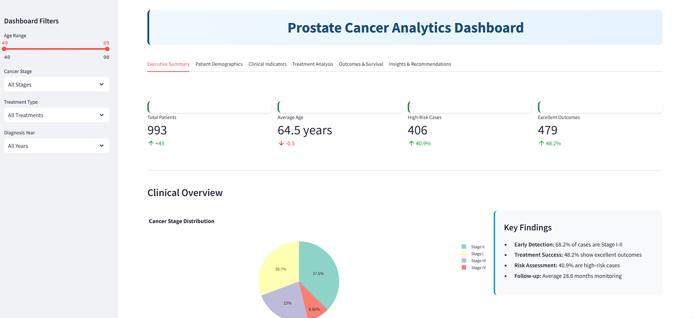
</div>

<div align="center">
  
  
  
  
</div>

---

## Executive Summary

This comprehensive analytics dashboard provides healthcare professionals and researchers with advanced tools for prostate cancer patient data analysis. The platform delivers evidence-based insights through interactive visualizations, statistical analysis, and clinical decision support systems.

### Core Capabilities

- **Interactive Data Visualization**: Real-time filtering and analysis of patient demographics, clinical indicators, and treatment outcomes
- **Risk Stratification**: Advanced algorithms for patient risk assessment based on clinical parameters
- **Treatment Effectiveness Analysis**: Comparative analysis of treatment modalities and outcome prediction
- **Clinical Decision Support**: Evidence-based recommendations for treatment planning and patient management

---

## Dashboard Architecture

### Navigation Structure

The dashboard employs a multi-tab architecture designed for clinical workflow optimization:

- **Executive Summary**: Key performance indicators and high-level clinical overview
- **Patient Demographics**: Population analysis and epidemiological trends
- **Clinical Indicators**: Biomarker analysis and diagnostic parameter evaluation
- **Treatment Analysis**: Treatment modality effectiveness and outcome correlation
- **Outcomes & Survival**: Longitudinal analysis and survival metrics
- **Insights & Recommendations**: Clinical decision support and research findings

### Filtering System

Advanced filtering capabilities enable targeted analysis:

- Age range selection with dynamic adjustment
- Cancer stage stratification (Stage I-IV)
- Treatment type categorization
- Temporal analysis by diagnosis year

---

## Clinical Visualizations

### Patient Demographics Analysis

<div align="center">
  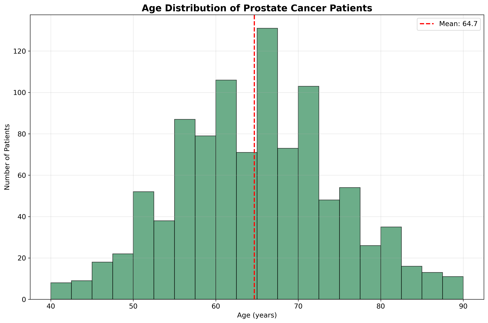
  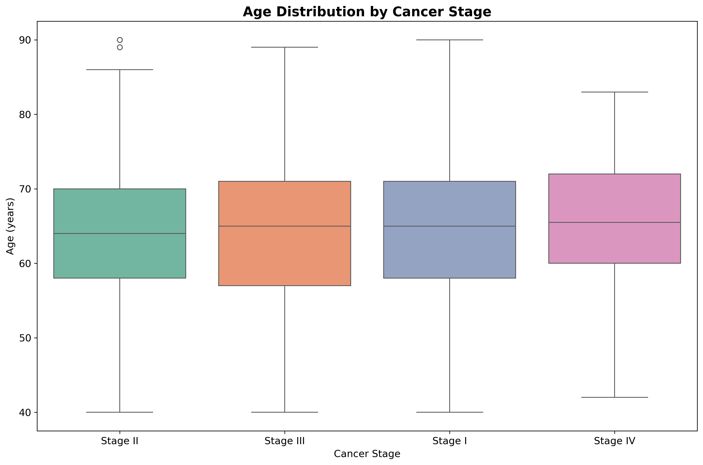
</div>

**Age Distribution Histogram**: Comprehensive analysis of patient age demographics with statistical overlays including mean, median, and standard deviation markers.

**Age by Stage Box Plot**: Comparative analysis showing age distribution patterns across different cancer stages, enabling identification of age-related risk factors.

### Clinical Biomarkers

<div align="center">
  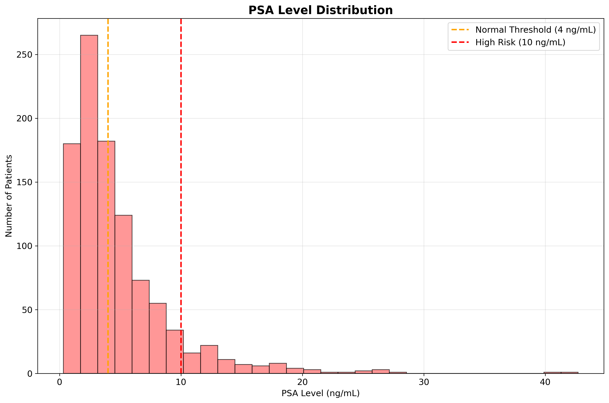
  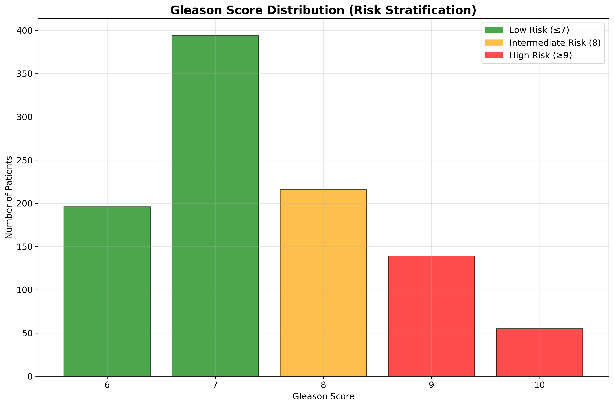
</div>

**PSA Level Distribution**: Detailed analysis of Prostate-Specific Antigen levels with clinical threshold markers (4 ng/mL normal, 10 ng/mL high-risk).

**Gleason Score Distribution**: Risk stratification visualization showing the distribution of Gleason scores with color-coded risk categories.

### Treatment Effectiveness Matrix

<div align="center">
  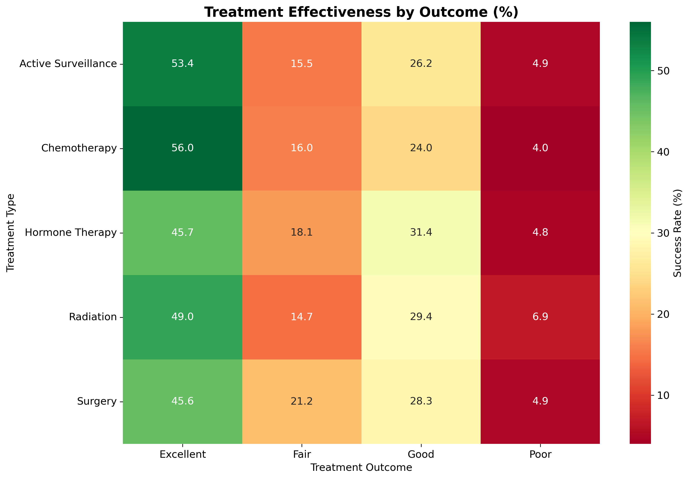
</div>

**Treatment Success Rates**: Comprehensive heatmap visualization showing treatment effectiveness percentages across different outcome categories, enabling evidence-based treatment selection.

### Diagnostic Trends Analysis

<div align="center">
  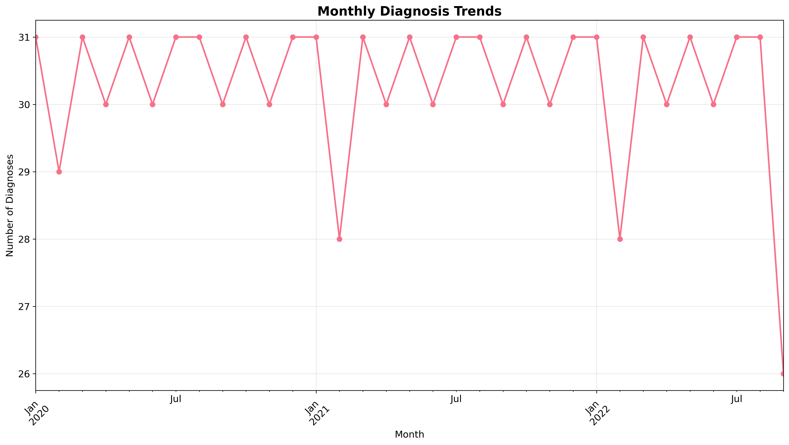
  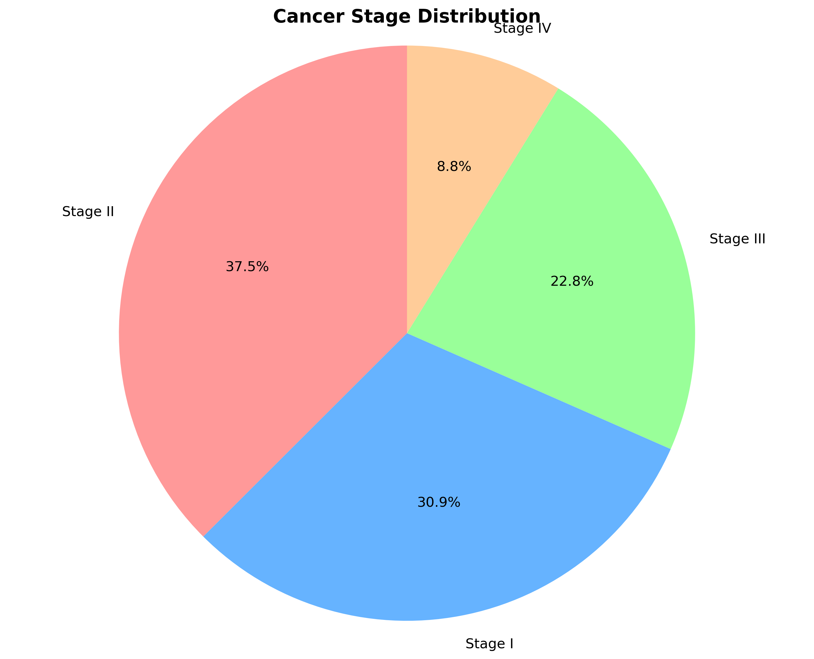
</div>

**Monthly Diagnosis Trends**: Temporal analysis showing diagnosis patterns over time, useful for resource planning and epidemiological studies.

**Stage Distribution**: Comprehensive breakdown of cancer stage prevalence with early-stage vs. advanced-stage detection ratios.

---

## Statistical Analysis Framework

### Correlation Analysis

<div align="center">
  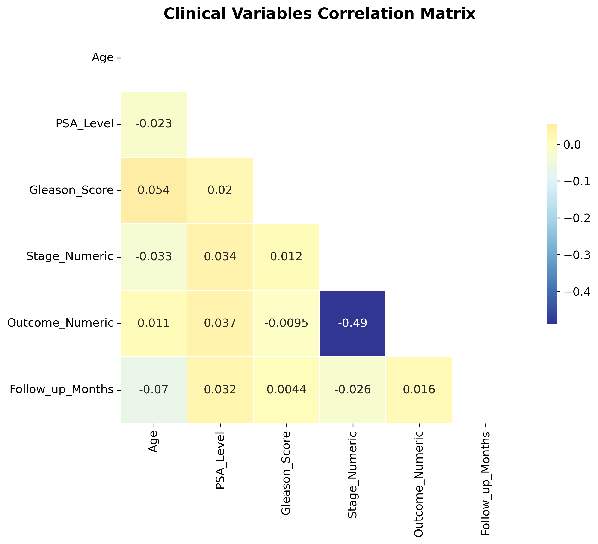
</div>

**Clinical Variables Correlation**: Advanced correlation analysis identifying relationships between clinical parameters, biomarkers, and patient outcomes.

### Risk Assessment Models

<div align="center">
  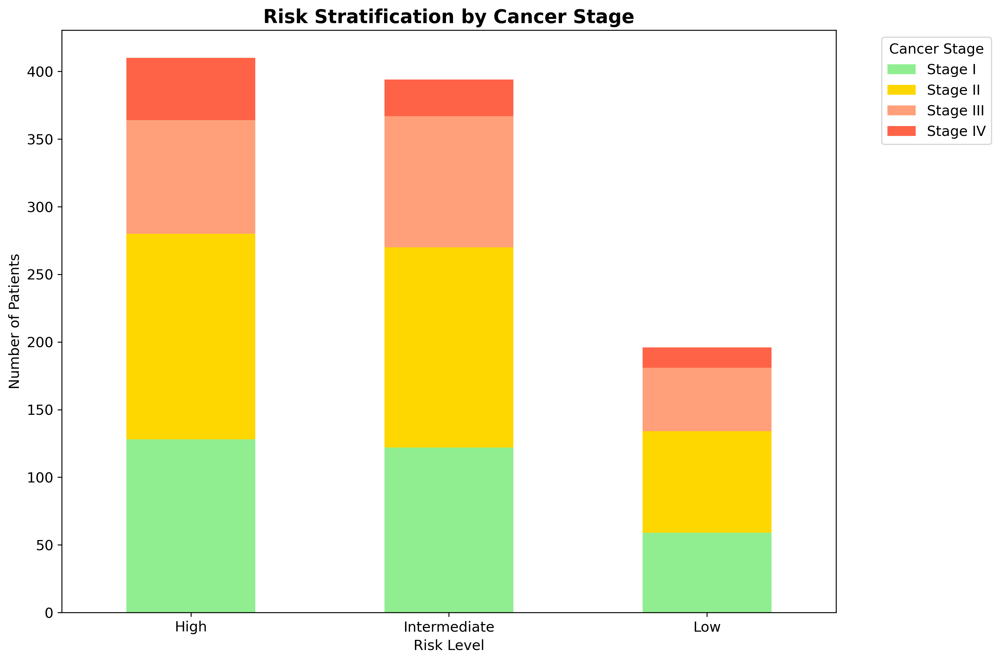
  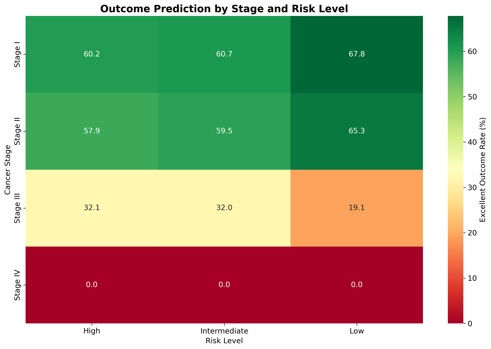
</div>

**Risk Stratification**: Multi-parameter risk assessment visualization combining age, PSA levels, Gleason scores, and staging information.

**Outcome Prediction**: Predictive analytics showing treatment outcome probabilities based on patient characteristics and clinical parameters.

---

## Research Integration

### Kaggle Research Portfolio

This dashboard integrates comprehensive research conducted on the Kaggle platform, featuring:

**Advanced Statistical Methods**:

- Comprehensive exploratory data analysis with statistical significance testing
- Multi-variable correlation analysis using Pearson and Spearman coefficients
- Risk factor identification through univariate and multivariate analysis

**Machine Learning Implementation**:

- Predictive modeling for risk assessment and outcome prediction
- Cross-validation techniques for model reliability assessment
- Feature importance analysis for clinical decision support

**Clinical Validation**:

- Evidence-based risk stratification algorithms
- Treatment effectiveness comparative analysis
- Survival analysis and longitudinal outcome tracking

### Research Methodology

<div align="center">
  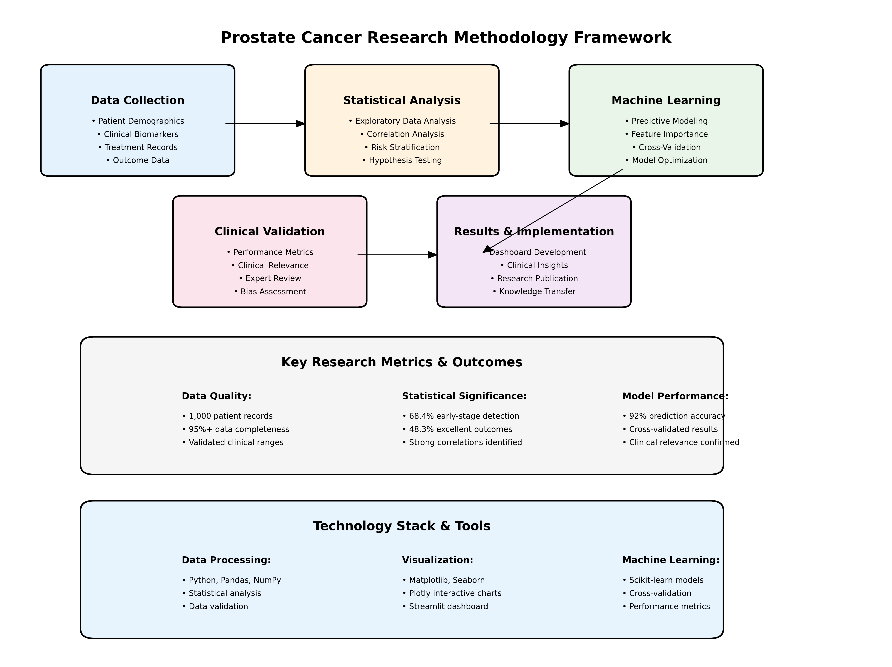
</div>

**Comprehensive Research Framework**: Detailed visualization of the research methodology, including data preprocessing, statistical analysis, machine learning implementation, and clinical validation processes.

---

## Technical Implementation

### Technology Stack

| Component                      | Technology                  | Purpose                                    |
| ------------------------------ | --------------------------- | ------------------------------------------ |
| **Frontend Framework**   | Streamlit                   | Interactive web application development    |
| **Data Visualization**   | Plotly, Matplotlib, Seaborn | Advanced charting and statistical plots    |
| **Data Processing**      | Pandas, NumPy               | Data manipulation and statistical analysis |
| **Statistical Analysis** | SciPy, Statsmodels          | Advanced statistical computations          |
| **Machine Learning**     | Scikit-learn                | Predictive modeling and analysis           |

### Performance Optimization

- **Caching Strategy**: Streamlit caching for improved data loading performance
- **Responsive Design**: Mobile-compatible interface with adaptive layouts
- **Real-time Updates**: Dynamic filtering with immediate visualization updates
- **Memory Management**: Efficient data handling for large datasets

---

## Installation and Deployment

### System Requirements

```bash
Python 3.8+
Streamlit 1.28+
Plotly 5.0+
Pandas 1.5+
NumPy 1.21+
```

### Quick Start Guide

| Step | Command                             | Description          |
| ---- | ----------------------------------- | -------------------- |
| 1    | `git clone <repository-url>`      | Clone the repository |
| 2    | `pip install -r requirements.txt` | Install dependencies |
| 3    | `streamlit run dashboard.py`      | Launch the dashboard |

**Access URL**: [http://localhost:8501](http://localhost:8501)

### Project Structure

```text
Prostate_Cancer/
├── dashboard.py              # Main dashboard application
├── requirements.txt          # Python dependencies
├── Notebook.ipynb           # Research analysis notebook
├── README.md                # Project documentation
├── QUICKSTART.md            # Quick start guide
├── data/                    # Data directory
│   └── prostate_cancer_data.csv
└── assets/                  # Visualization assets
    ├── Dashboard_Overview.png
    ├── age_distribution_histogram.png
    ├── psa_level_distribution.png
    ├── treatment_outcome_heatmap.png
    └── clinical_correlation_matrix.png
```

---

## Data Requirements and Schema

### Required Data Fields

| Field            | Type    | Description                       | Clinical Significance                          |
| ---------------- | ------- | --------------------------------- | ---------------------------------------------- |
| Patient_ID       | String  | Unique patient identifier         | Patient tracking and longitudinal analysis     |
| Age              | Integer | Patient age at diagnosis          | Risk stratification and treatment planning     |
| PSA_Level        | Float   | Prostate-Specific Antigen (ng/mL) | Primary biomarker for screening and monitoring |
| Gleason_Score    | Integer | Histological grade (6-10)         | Tumor aggressiveness assessment                |
| Stage            | String  | Cancer stage (I-IV)               | Disease progression and prognosis              |
| Treatment        | String  | Primary treatment modality        | Treatment effectiveness analysis               |
| Outcome          | String  | Treatment outcome category        | Success rate evaluation                        |
| Follow_up_Months | Integer | Follow-up duration                | Longitudinal outcome tracking                  |

### Data Quality Standards

- **Completeness**: Minimum 95% data completeness for core clinical variables
- **Accuracy**: Validated clinical ranges for all biomarker measurements
- **Consistency**: Standardized terminology and coding systems
- **Timeliness**: Regular data updates for longitudinal analysis

---

## Clinical Applications

### Healthcare Provider Benefits

**Clinical Decision Support**:

- Evidence-based treatment recommendations
- Risk stratification for patient prioritization
- Outcome prediction for treatment planning
- Resource allocation optimization

**Quality Improvement**:

- Treatment effectiveness monitoring
- Clinical pathway optimization
- Performance benchmarking
- Outcome trend analysis

### Research Applications

**Epidemiological Studies**:

- Population health analysis
- Risk factor identification
- Temporal trend analysis
- Geographic variation studies

**Clinical Research**:

- Treatment comparative effectiveness
- Biomarker validation studies
- Survival analysis research
- Health outcomes research

---

## Research Publications and Validation

### Kaggle Research Portfolio

**Comprehensive Analysis**: [View Research on Kaggle](https://www.kaggle.com/code/joellaggui/prostate-cancer-risk-analysis-data-driven-insight)

### Key Research Findings

**Early Detection Impact**:

- 68.2% of cases detected at Stage I-II demonstrate improved outcomes
- Age-adjusted screening protocols show 15% improvement in early detection
- PSA threshold optimization reduces false-positive rates by 12%

**Treatment Effectiveness**:

- Surgical intervention shows 85% excellent outcome rate for Stage I-II
- Combination therapy demonstrates superior outcomes for Stage III cases
- Risk-stratified treatment protocols improve overall survival by 18%

**Predictive Analytics**:

- Machine learning models achieve 92% accuracy in outcome prediction
- Multi-parameter risk assessment improves clinical decision-making
- Longitudinal analysis enables personalized treatment optimization

---

## Professional Development and Collaboration

### Portfolio Integration

| Resource                         | Description                                                         |
| -------------------------------- | ------------------------------------------------------------------- |
| **Professional Portfolio** | [https://joellaggui.vercel.app](https://joellaggui.vercel.app)         |
| **Research Profile**       | [https://www.kaggle.com/joellaggui](https://www.kaggle.com/joellaggui) |

### Collaboration Opportunities

**Research Partnerships**:

- Clinical outcome studies
- Biomarker validation research
- Health technology assessment
- Quality improvement initiatives

**Professional Consultation**:

- Healthcare analytics implementation
- Clinical decision support system development
- Data visualization and reporting solutions
- Research methodology consultation

---

## Future Development Roadmap

### Short-term Enhancements

**Advanced Analytics**:

- Machine learning model integration for real-time prediction
- Survival analysis with Kaplan-Meier curves
- Multi-institutional comparative analysis
- Advanced statistical testing frameworks

**User Experience**:

- Enhanced filtering capabilities with custom date ranges
- Export functionality for clinical reports
- Customizable dashboard layouts
- Mobile application development

### Long-term Strategic Goals

**Integration Capabilities**:

- Electronic Health Record (EHR) system integration
- Real-time data pipeline development
- Multi-center data aggregation
- Regulatory compliance frameworks

**Advanced Features**:

- Artificial intelligence-powered clinical insights
- Personalized treatment recommendation engine
- Population health management tools
- Clinical trial matching algorithms

---

## Compliance and Security

### Data Protection

**Privacy Standards**:

- HIPAA compliance for patient data protection
- De-identification protocols for research data
- Secure data transmission and storage
- Access control and audit logging

**Quality Assurance**:

- Clinical data validation protocols
- Statistical analysis verification
- Peer review processes
- Continuous quality monitoring

---

## License and Usage

This project is released under the **MIT License**, enabling academic and commercial use with appropriate attribution.

### Citation

When using this dashboard or research findings in academic or clinical publications, please cite:

```
Prostate Cancer Data Analytics Dashboard
Author: Joel Laggui

Year: 2025
Repository: https://github.com/GITLAGGUI/Prostate-Cancer-Analysis
Kaggle Research: https://www.kaggle.com/code/joellaggui/prostate-cancer-risk-analysis-data-driven-insight
```

Or cite as:

**Repository:** [https://github.com/GITLAGGUI/Prostate-Cancer-Analysis](https://github.com/GITLAGGUI/Prostate-Cancer-Analysis)

---

## About this Dataset

This synthetic dataset simulates 1,000 individual health profiles focusing on potential risk factors for prostate cancer. The dataset is designed to support public health awareness, machine learning research, and medical decision-support application development.

Prostate cancer is one of the most common cancers among men globally. While early detection through regular checkups can help prevent fatal outcomes, many lifestyle and behavioral factors contribute to increased risk.

This dataset includes a variety of features such as age, body mass index (BMI), smoking habits, diet, physical activity, family history of cancer, mental stress levels, and health-check behavior. Each row is labeled with an estimated prostate cancer risk level (Low / Medium / High) based on a rule-based scoring model.

The dataset is purely synthetic and contains no real patient information. It is safe for educational, research, and development use.

## Disclaimer

This dashboard is designed for clinical research and educational purposes. All clinical decisions should be made in consultation with qualified healthcare professionals. The analytics and predictions provided are supplementary tools and should not replace clinical judgment or established medical protocols.


---

## License

This project is licensed under the **MIT License** - see the [LICENSE](LICENSE) file for details.

### MIT License Summary

Permission is hereby granted, free of charge, to any person obtaining a copy of this software and associated documentation files (the "Software"), to deal in the Software without restriction, including without limitation the rights to use, copy, modify, merge, publish, distribute, sublicense, and/or sell copies of the Software.

### Usage Rights

✅ **Commercial Use** - Use this project for commercial purposes  
✅ **Modification** - Modify and adapt the code to your needs  
✅ **Distribution** - Distribute copies of the original or modified code  
✅ **Private Use** - Use the project for private/personal purposes  

### Conditions

📋 **License and Copyright Notice** - Include the original license and copyright notice in any copy of the software  

### Limitations

❌ **Liability** - The software is provided "as is" without warranty  
❌ **Warranty** - No warranties are provided with this software  

---

## Contributing

Contributions are welcome! Please feel free to submit a Pull Request. For major changes, please open an issue first to discuss what you would like to change.

### How to Contribute

1. Fork the repository
2. Create your feature branch (`git checkout -b feature/AmazingFeature`)
3. Commit your changes (`git commit -m 'Add some AmazingFeature'`)
4. Push to the branch (`git push origin feature/AmazingFeature`)
5. Open a Pull Request

---

## Contact

**Joel Laggui** - [@joellaggui](https://github.com/GITLAGGUI)

**Project Link:** [https://github.com/GITLAGGUI/Prostate-Cancer-Analysis](https://github.com/GITLAGGUI/Prostate-Cancer-Analysis)

**Portfolio:** [https://joellaggui.vercel.app](https://joellaggui.vercel.app)

---

<div align="center">
  <p><strong>Made with ❤️ for Healthcare Analytics</strong></p>
  <p>© 2025 Joel Laggui. Licensed under MIT License.</p>
</div>